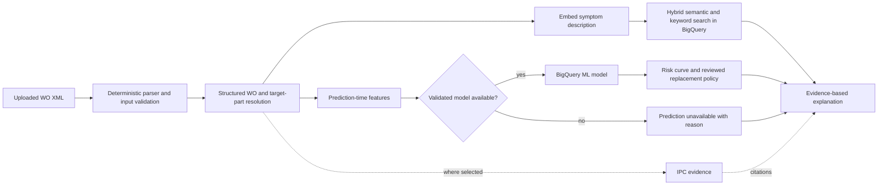

# BigQuery predictive-maintenance POC plan

Date: 2026-09-22

Status: **Draft with predictive-maintenance objective, broader training scope, temporal holdout and fixed-data constraint confirmed.** Train using eligible older records across all available parts, including the three target PNs; reserve newer target-part episodes for final evaluation and focus the demo on those PNs. The desired output remains a prediction supporting replacement before failure, potentially using BigQuery ML. No additional AMOS data can be obtained. Use the existing AMOS snapshot, three FAA SDR CSVs and supplied IPC extracts. Broader training is a proposed experiment, not evidence that a valid cycle forecast exists. Input timing/state and optional KB integration remain open. No application, model training or infrastructure implementation is included in this planning change.

Baseline: repository commit `628bbb7`, [plan review](PMA-POC-plan-review.md), [data audit](docs/audits/pma-poc-data-profile-2026-09-22.json), [handover](CLAUDE-CODE-HANDOVER.md), and the existing AMOS parser, BigQuery specialist and IPC KB.

## 1. User goal and fixed component scope

The user supplies a work order as XML. The system parses it, identifies symptoms and relevant target parts, constructs information available at the prediction time, obtains a statistical failure-risk/time-to-event estimate, and uses a reviewed decision policy to suggest a replacement window before failure. Historical cases and available manuals explain and constrain the result. The statistical model produces the numbers; the language model explains them with evidence.

An exact failure cycle is generally not knowable in advance. The intended predictive output is a probability over a cycle horizon and, when the data supports it, a time-to-failure distribution/range. Selecting a preventive replacement window also requires a risk tolerance, planning lead time and any applicable maintenance limits. The system must not promise that a part cannot fail before its suggested window.

The final test/demo scope is fixed by these three PNs, not selected by replacement frequency. **Training may use eligible examples from every available PN**, as requested; the three-PN restriction applies to the product scope and final evaluation, not to the whole training corpus.

| PN | Description confirmed in local IPC | Local manual evidence |
|---|---|---|
| `2085M31G03` | Fuel-injection nozzle | `data/ipc_part_numbers/M73-82/73-11___042.pdf`, PDF p.184, 73-11-05 Fig.01, printed p.2, item 20. |
| `62197-301-001` | Water boiler | `data/ipc_part_numbers/M73-82/25-32___042.pdf`, PDF p.26, 25-32-22 Fig.12M, printed p.1, item 10. |
| `8201-11-0000-01` | Convection oven assembly | MAX-family chapter above, PDF p.22, 25-32-03 Fig.33, item 20; also `B737-8/25-31___124.pdf`, PDF p.29, 25-31-11 Fig.15E, item 180. |

These are local PDF checks, not verification of the live KB. The supplied IPC extracts establish part identification, quantities, effectivity and references; no flight-cycle replacement deadline was found. Referenced AMM/CMM/SB documents are not thereby available as full procedures. Catalogue quantities such as 18 nozzle units per assembly must never become cycle limits.

An occurrence in a family-level IPC is not proof of applicability to a particular aircraft or installation. Keep family and effectivity evidence. Do not infer that a part is forbidden on another family merely because that family's relevant chapter is absent from the supplied corpus.

## 2. Confirmed constraints and pending decisions

| Decision | Recommended approach | Status |
|---|---|---|
| Purpose of timing output | Predict failure risk and support a preventive replacement window. Separate model output from the maintenance decision rule. | Confirmed by the user's latest clarification. Historical summaries alone do not fulfill this objective. |
| Available data | Existing AMOS XML snapshot, FAA SDR CSVs for 2023–2025, and supplied IPC extracts. | Confirmed: no additional AMOS records can be obtained. Further work must use this fixed corpus. |
| Training versus test scope | Train across eligible available parts; reserve a final test set containing only the three target PNs. | Confirmed by the user. “All data” means broad source/PN coverage while excluding held-out records and unusable labels. |
| Target-part holdout | Include older eligible target-PN examples in training and test on newer target episodes. | Confirmed by the user. Keep a separate development set and freeze final-test episodes before fitting or tuning. |
| Semantic matching | Embed AMOS work-step descriptions and FAA report narratives in a shared vector space; combine semantic search with structured filters and keyword matches. | Added to the proposed implementation following the user's suggestion. Benchmark against the keyword baseline on the three target PNs. |
| Failure target and available labels | Confirmed component failure, with scheduled/serviceable changes identified separately. | Desired target confirmed; usable labels and exposure must be assessed within the existing files. An alternative removal/triage target would be a separately named experiment. |
| Horizon and decision policy | Start with one agreed cycle horizon for risk; then estimate a risk curve and define a reviewed replacement-window policy. | Horizon, acceptable risk, lead time and policy owner remain to be defined. |
| Use of KB in this workflow | BigQuery supplies history; consult the KB for part identity/applicability or an actual documented rule. | Asked: combine where relevant versus history only. Earlier separate-specialist choice is retained for ordinary chat pending this clarification. |
| Input timing/state | A new/open WO with current aircraft TAC and an analysis timestamp; alternatively an explicitly labeled closed-WO replay. | Asked whether input is open/current or completed/replay, and whether the counter is supplied. |

The fixed PNs, uploaded-XML use case and predictive objective are confirmed. An insufficient-evidence response remains necessary for an unsupported component or input, but does not count as completion of the predictive objective. Do not silently change the target from failure to all-cause replacement to make a model trainable.

The [targeted local audit](docs/audits/pma-three-part-profile-2026-09-22.json) provides these AMOS counts across aircraft families. They are not confirmed failures or training labels:

| PN | Observed outgoing swaps | Distinct replacement WOs | Distinct same-aircraft/lower-TAC/ATA-4 candidate WO pairs |
|---|---:|---:|---:|
| `2085M31G03` | 700 | 81 | 5 |
| `62197-301-001` | 1,082 | 1,074 | 1,103 |
| `8201-11-0000-01` | 573 | 572 | 655 |

The nozzle's five earlier candidate WOs already replace the same target PN. The boiler/oven also contain many earlier replacement WOs, so a recurrent replacement can be mistaken for a precursor. Installation boundaries and true symptom observations must be established before labeling these examples. Some source records are outside NG/MAX or lack aircraft identity: the oven has 565 swaps and 652 candidate pairs after NG/MAX filtering; the nozzle has 674 MAX swaps and 26 swaps with missing aircraft identity. Boiler positions have 40 raw strings and oven positions 39, requiring reviewed normalization without merging distinct physical locations.

### 2.1 What the FAA CSVs actually add

The [FAA audit](docs/audits/pma-three-part-faa-profile-2026-09-22.json) scans all **196,404** parsed CSV records: 62,688 in 2023, 66,079 in 2024 and 67,637 in 2025. Both `PartNumber` and `ComponentPartNumber` were checked independently. These are Service Difficulty Reports, not additional AMOS histories or a population of 196,404 monitored components.

| Target PN | Reports matching normalized PN | Reports with positive target-part cycles | Aircraft scope |
|---|---:|---:|---|
| `2085M31G03` | 7 | 2 | All seven have FAA aircraft model `7379`. |
| `62197-301-001` | 0 | 0 | No matching report. |
| `8201-11-0000-01` | 47 | 0 | 24 Boeing reports (23 `737823`, one `7378`) and 23 Airbus reports. |

All 54 target matches are in `PartNumber`; none is in `ComponentPartNumber`. All 47 oven matches require punctuation normalization; an exact-string search would miss them. Preserve the raw value alongside the normalized key, and review FAA-to-AMOS aircraft-family mapping rather than equating similar-looking model codes.

The two nozzle reports with `PartTotalCycles` contain 1,391 and 1,840 and also have part serials and valid difficulty dates. Those are reported part counters at a difficulty event, not cycles remaining after the uploaded symptom. All 47 oven reports lack both part/component cycle counts and serials. All 54 matching reports have aircraft cycle values, which cannot substitute for component age. These two part-counter observations do not establish target-specific timing labels; broader training eligibility is assessed separately in section 2.3.

Whole-word searches of `PartName`/`ComponentName` identify **34 nozzle**, **17 boiler/water-heater** and **361 oven** reports across all PNs. These are heuristic review pools, not exhaustive narrative searches or interchangeable component populations; nozzle matches can describe unrelated nozzle types. The corpus has no exact duplicated parsed rows and has 196,404 distinct nonblank `OperatorControlNumber` values. This does not establish 196,404 unique physical failures: related/supplemental event grouping still needs review.

Use three evidence tiers:

1. **Exact normalized PN and compatible application:** retrieve reported symptoms, diagnosed defects and actions with source citations. Keep report counts distinct from failure counts.
2. **Reviewed equivalent PN or related component:** expand symptom vocabulary and test extraction/classification transfer. Preserve the relationship and compatibility evidence; do not pool cycle outcomes into the target part's lifetime model.
3. **Remaining FAA corpus:** develop general extraction and text-relevance baselines. Unrelated reports may be negatives for text relevance, never healthy controls for the target part's failure risk.

FAA is most useful here as symptom/defect knowledge. Its event-selected sample does not establish time spent in service without failure, and therefore does not supply the missing denominator for fleet risk calibration. Evaluate any FAA-derived features on held-out AMOS examples. Keep report-time diagnosis/action text out of purported prediction-time features.

### 2.2 Stronger AMOS links within the fixed snapshot

The [serial-continuity audit](docs/audits/pma-serial-continuity-profile-2026-09-22.json) checks whether an installed target PN/serial appears later as removed on the same aircraft. Its conservative candidates require increasing closure timestamp and TAC, consecutive unambiguous observed PN/serial appearances, matching nonempty positions, and no observed conflicting appearance on another aircraft during the interval.

| PN | Candidate on-to-off intervals | Distinct WO pairs | Aircraft | Intervals containing another same-ATA-4 WO |
|---|---:|---:|---:|---:|
| `2085M31G03` | 5 | 1 | 1 | 0 |
| `62197-301-001` | 339 | 339 | 204 | 78 |
| `8201-11-0000-01` | 134 | 134 | 98 | 38 |

The oven's 134 candidates include three A320 intervals; NG/MAX-only support is 131. All five nozzle intervals belong to a single WO pair, so they are not five independent maintenance episodes. These counts differ from the earlier ATA-only candidate pairs because they require actual on/off serial continuity. The audit's placeholder-serial screen excludes no target appearances. Among the boiler candidates, 35 contain another target movement at the same coarse position, and one has an intermediate aircraft counter outside the endpoint range; keep these review flags rather than assuming uninterrupted service.

**Start the interval/outcome review with 303 boiler and 131 NG/MAX oven candidates.** Excluding the boiler's observed position/counter conflicts leaves 303 candidates across 192 aircraft; 58 intervals contain 72 distinct intermediate ATA-4 WOs. The 131 NG/MAX oven candidates have no such flags; 38 intervals contain 47 distinct intermediate ATA-4 WOs. These are useful review pools within the fixed data. Same-ATA intermediate WOs are not proven precursors; the same aircraft may have several similar installed parts. Closing-counter differences measure observed installation/removal endpoints approximately, not symptom lead time. Endpoint serial agreement does not establish uninterrupted installation, complete follow-up, a confirmed failure or what would happen without preventive replacement. Section 8.1 determines whether anything stronger is estimable.

### 2.3 Train broadly, test on the three target parts

The user confirmed the split: use the broader corpus, including older target-part records, to learn transferable patterns and report the final held-out results on newer episodes for `2085M31G03`, `62197-301-001` and `8201-11-0000-01` separately. Limited exact-PN FAA coverage does not by itself rule out learning useful features from other parts.

| Training task | Eligible broader data | What the target-PN test measures |
|---|---|---|
| Symptom representation, component/defect classification and retrieval | Reviewed FAA and AMOS text across parts, excluding held-out records/duplicates. Relevant labels and prediction-time text rules still apply. | Correct categories, relevant historical matches and transfer to the three target PNs. |
| Documented-removal association | AMOS WOs across PNs with comparable reviewed outcomes and usable pre-action symptoms. FAA diagnosis classes remain separate unless the target and observation process can be aligned. | Performance for the recorded maintenance outcome on held-out target WOs. |
| Failure risk or cycles to a defined event | All PNs with compatible event definitions, valid origins/counters, installation links and required observation/follow-up. Audit eligibility across the full AMOS corpus. | Risk calibration or timing accuracy on target episodes, if the target test itself has valid labels and sufficient support. |

Use the confirmed **older-record training and newer-record testing** design: train on eligible older examples across all PNs, including older target-PN records; tune on a separate development set; freeze newer target-part episodes for final testing. Select and record calendar cutoffs from eligible episode counts and label maturity before fitting models. Keep the training cutoff consistent across all PNs and sources. No models are fitted or selected in this planning change.

Hold out whole related component/maintenance episodes, not random rows; purge shared episodes and duplicate narratives from training/development. Freeze the final test before learning vocabularies, embeddings/fine-tuning, label rules or thresholds from this corpus. A fixed pretrained embedding model may transform held-out text at inference; held-out text cannot update fitted representations or enter the retrieval reference index. Respect training cutoffs and label maturity for all PNs and FAA availability dates.

Train a parsimonious pooled baseline with reviewed component class/system, aircraft context, prediction-time symptom features and relevant age/history features. PN alone cannot explain an unseen component's behavior. Compare the pooled baseline with compatible-system models and, where enough data exists, a target-only baseline. Use data weighting and per-target validation to detect negative transfer; no majority class or unrelated component may dominate the reported result. Fit probability calibration and policy thresholds on development data only; the final test measures them without retuning. A pooled model's aggregate score does not establish accuracy for the three targets.

Broader training can improve feature learning and effective training support. It does not turn an FAA event counter into a symptom-to-failure interval, nor create valid held-out timing labels for the target PNs. An end-of-event narrative containing a diagnosis and repair also is not an early symptom sequence. Keep all usable records in the tasks they support; do not force every row into supervised cycle training.

## 3. Proposed user flow

The model and policy steps below describe the intended capability, conditional on the fixed-data feasibility gate. The first implementation must work with explicit unavailable prediction fields when that gate fails.

1. Upload XML and select the WO if the envelope contains several. The result identifies the parsed WO, aircraft, relevant work steps, current/symptom counter and any missing input.
2. Resolve zero, one or several of the three target PNs. Prefer explicit component/part fields; retain whether a PN was requested, installed, removed or merely mentioned. A symptom may exist before a part is named, so reviewed component descriptions and optional IPC evidence can suggest candidates. Ask the user to resolve ambiguity rather than silently select a part.
3. Embed the uploaded symptom description and retrieve semantically similar AMOS/FAA records using the same embedding model, combined with keyword/metadata matching. Separate the aircraft's own history, comparable AMOS cases and public FAA reports. Show source IDs, dates, excerpts and compatibility; absence of an exact PN mention must not prevent symptom matching.
4. For each historical symptom case, find a supported later replacement outcome on that same historical aircraft/component installation. Exclude unresolved installation links from timing calculation while retaining useful retrieved evidence.
5. Score the eligible uploaded WO with the validated model for its part/family and prediction context. Return the predicted probability within the agreed cycle horizon, and a timing distribution only if supported by the chosen model and follow-up. Historical intervals are supporting evidence, not the forecast itself.
6. Apply the reviewed replacement policy to the model output, including maintenance limits and planning lead time where available. Explain the proposed window, prediction basis, model version, historical support and limitations. If the model or decision policy is unavailable, identify that specific gap rather than generating an unsupported deadline.

A useful fallback answer is: "These work orders describe similar symptoms, but this part does not yet have a validated model and sufficient follow-up to estimate its failure timing." This is a valid per-request fallback, not proof that the overall predictive POC is complete.

## 4. Architecture and existing assets



There are two distinct paths:

- **Offline training/preparation:** source histories -> shared parser -> current BigQuery tables/views -> installation and observation cohorts -> prediction-time features and labels -> temporal/episode splits -> train, evaluate and select a model version. A versioned text-preparation/embedding job builds the eligible historical reference corpus after split assignment.
- **Online analysis:** uploaded XML -> shared parser -> analysis context -> query embedding and filtered semantic/keyword retrieval -> identical prediction feature transformations -> any eligible model scoring and reviewed planning policy -> explanation with retrieved evidence. An upload is not automatically inserted into the training history or historical search index, or treated as a completed outcome.

Reuse `scripts/wo_xml.py` and `scripts/xml_to_ndjson.py`; move reusable parsing logic into an application-owned module if necessary while preserving the batch script interface. The current parser selects the first WO, uses literal namespace paths and silently skips malformed files in the batch iterator. It is not ready to accept arbitrary uploads unchanged.

`pm_agent/fast_api_app.py` already mounts ADK web/API and a shared artifact service, but no dedicated WO-analysis endpoint exists. The current router extracts only `part.text`; XML attachments do not automatically become parsed analysis requests. Add an explicit input adapter and analysis route instead of relying on the language model to read raw XML.

Keep ordinary IPC/BQ chat behavior available. A dedicated `wo_analysis` route/workflow can invoke bounded history tools and, if selected, the existing IPC specialist. This avoids rewriting all chat orchestration to support one structured workflow. Preserve the existing Gemini model and configuration.

The repo currently has no AMOS/FAA embedding job, vector table/index or semantic retrieval tool. The existing IPC datastore handles PDF search, and the existing BigQuery connection serves telemetry files in GCS. Neither implements this text-vector layer; add its document preparation, batch generation and query tool explicitly.

## 5. Parser and request contract

Proposed shared interface: `parse_workorders(xml_bytes) -> ParsedWorkOrder[]` plus structured diagnostics. Both offline ingestion and online uploads must use the same field definitions.

Required behavior:

- Handle namespaced and unnamespaced AMOS envelopes, multiple WOs, repeating steps/actions/changes, malformed input and missing optional fields. Never silently discard additional WOs.
- Validate supported envelope/payload types and retain schema versions. A schema version is not a WO revision ID.
- Preserve WO, step, action and change UUIDs, source filename/artifact version and content hash. Report duplicate/conflicting identities; do not hide them with `DISTINCT`.
- Parse both date and timestamp forms using real calendar validation. Preserve timezone/precision and distinguish issue, action, close, export and analysis timestamps.
- Keep symptom descriptions separate from completed actions, part requests and part changes. Attach availability/provenance to each field where known.
- Keep `issue.tac`, `closing.total_aircraft_cycles` and a user-supplied current TAC separately. A current TAC cannot silently overwrite an old issue TAC. Missing/invalid counters may allow retrieval while preventing timing.
- Apply upload size/record limits and a parser configuration that rejects DTD/entity expansion and external resource loading. Do not load arbitrary user-supplied filesystem paths or send raw XML into model prompts/logs.

Proposed analysis input:

```text
xml_file or session-scoped artifact reference
selected_wo_id, if the envelope contains multiple WOs
mode: new_work_order | historical_replay
analysis_as_of
current_aircraft_tac, when absent from the appropriate XML field
current_tac_source / observed_at
optional target_part_number, from the fixed three-PN set
```

For a new WO, record the symptom observation time/counter if different from the current assessment. For a replay, explicitly define which fields were available at the replay timestamp. Removing action text from a closed export does not prove the remaining description is the original unedited symptom.

Implement one shared analysis service. A small `POST /workorders/analyze` upload endpoint and an ADK artifact adapter can call it; confirm the preferred demo surface during implementation. The acceptance test must exercise an actual XML upload, not only a pasted natural-language summary. Analysis should return per-WO status for a batch or require an explicit selection.

## 6. BigQuery views and durable artifacts

**Use ordinary logical views** for stable field definitions and correct array handling. Views do not copy data, create historical versions, guarantee faster queries or enforce source isolation by themselves. Keep `pma_agent_analytics`, the existing source tables and `us-central1`; resolve the project from configuration.

| Object | Row grain and role |
|---|---|
| `v_work_orders` | One WO in the current source snapshot, including aircraft, dates/counters, source metadata and quality flags. Preserve WOs without part changes. |
| `v_symptom_records` | One work step with symptom text, WO/step identity, aircraft/ATA and available-at metadata/status. Actions are retained separately as outcome evidence. |
| `v_component_changes` | One change record with WO/step/action/change IDs, both PN/serial sides, position, action time and closing counter. Unnest only the parent-child chain. |
| `v_observed_removals` / `v_target_replacements` | All-PN removal candidates for training eligibility, plus a three-PN projection for serving/evaluation. Attribute to the removed part; retain eligibility/reason/quality flags and alternative incoming PN. Missing TAC excludes timing, not the inventory of changes. |
| `faa_sdr_reports` / `v_faa_component_evidence` | Separate versioned raw FAA import and curated report-level projection, with both PN fields, raw/normalized identifiers, date/counter quality and exact/related evidence tiers. Never create AMOS asset links from these reports. |
| Versioned target-part configuration | Exactly the three user-specified PNs, reviewed descriptions/aliases, available IPC references and applicability notes. No automatic Top-3 ranking. |
| `component_installations` / `component_outcomes` | Evidence-dependent artifacts reconstructed from the existing snapshot: candidate intervals, reviewed removal reasons, counters, observation ends and provenance. Keep candidate and confirmed statuses distinct; do not imply missing service histories exist. |
| `prediction_cohort` / `prediction_features` | Eligible part-installation/WO prediction points across PNs, as-of features, task/source-specific labels, follow-up/censoring status and time/episode splits. Separate training eligibility from the fixed three-PN final test. No future text or outcome information in features. |
| Versioned BigQuery ML models and evaluation records | Logistic baseline, candidate boosted-tree model, and later timing model/formulation; include target, horizon, feature version, training cutoff, metrics and deployment eligibility. |
| `historical_episode_links` | Persisted, reviewable symptom-record to outcome candidate links for retrieval and audit. Candidate/LLM links alone are not expert training labels. |
| `retrieval_documents` / `retrieval_embeddings` | Canonical AMOS/FAA text units and materialized vectors with source/record/segment identity, text role, source span/hash, embedding configuration, availability/split eligibility and quality/status fields. Share a vector space while preserving source namespaces. |

Terraform owns view definitions in the current module, with SQL templates under `deployment/terraform/shared/analytics_views/`. A documented batch command owns generated embeddings and link records; do not have Terraform and the batch job both overwrite those tables. Validate a new artifact version before selecting it for serving.

The existing `faa_sdr_wo_parts` table contains only 299 reports matching any WO PN. Its builder checks `PartNumber` first and otherwise `ComponentPartNumber`, retaining one match role; it is not the full FAA corpus or a complete two-field association table. For broader symptom experiments, extend the current Terraform/load pipeline to import the full local CSV snapshot into the separately named FAA table and derive the curated view. Preserve both PN roles and group any exploded association rows back to report grain for counts. Do not replace the existing table's contract or create a second infrastructure stack. Preserve raw counters and use flagged parsing rather than silently rounding/truncating invalid values. Build the embedding pipeline for eligible AMOS/FAA descriptions across all PNs; validate a small batch before processing the broader corpus. Final-test records, duplicates and empty/unusable text are excluded from the reference index.

## 7. Historical retrieval and precursor linking

Separate two questions: **"Which historical symptoms resemble this WO?"** and **"Which of those symptoms have a supported subsequent replacement outcome?"** Similarity alone answers neither causality nor timing.

1. Search the available symptom corpus, not only WOs already containing replacements. Constrain by reviewed part/system and aircraft compatibility; keep positional distinctions. Exact PN mention is a strong clue but cannot be mandatory for every early symptom.
2. Implement both a reproducible keyword/metadata baseline and BigQuery vector retrieval over AMOS/FAA text. Combine candidate rankings as described below, then measure improvement on the three target PNs. No separate Vertex Vector Search endpoint is required initially.
3. Return traceable cases, scores and filters. Scores rank relevance; they are not replacement probabilities.
4. Build historical outcome links offline or through reviewed deterministic queries. The precursor and outcome must share a valid aircraft timeline and compatible physical installation. Track intervening removals, serial/position ambiguity, calendar order and counter monotonicity. Same-aircraft and ATA match alone are insufficient.
5. Use a stable `replacement_event_id` from source/WO/change identity throughout every join and per-event ranking. Several swaps in one WO, including repeated PN/position combinations, remain distinct changes. Group maintenance episodes when estimating independent support.
6. Define lookback bounds, same-WO/zero-cycle handling and removal-reason policy with reviewed examples. Scheduled changes, cannibalization, and uncertain reasons cannot all become failures by default.
7. Optional LLM review can label a candidate relationship supported, contradicted or uncertain with cited evidence. Retain errors and rejected/uncertain rows; do not call LLM-positive links proven causal precursors.
8. For a prospective replay, reference information and historical outcomes must already be available by the simulated analysis cutoff. Exclude the uploaded WO and duplicate/revised representations from its own retrieval results. Aircraft cumulative TACs are not comparable across aircraft; use timestamps for cross-aircraft historical availability.

Use all three fixed PNs, but assess readiness separately. A part with many changes may have few distinct symptom/outcome episodes. Do not substitute another PN just to obtain a plausible-looking timing distribution.

### 7.1 Text to embed

Use one pinned pretrained text-embedding model for AMOS, FAA and uploaded queries. This gives comparable vectors without training a new embedding model first. Preserve the application's existing Gemini chat model; the embedding model is separately configured. Retain original source text for citations and a versioned normalized representation for embedding.

| Source/text role | Embedding unit | Treatment |
|---|---|---|
| AMOS symptom description | `work_steps[].description`, optionally its `headline`, keyed by WO and step UUID | Default symptom-search unit. Preserve each field's provenance/availability; a closed snapshot may contain edited text. WO remarks and event titles are not automatically symptom fields. |
| FAA historical narrative | `Discrepancy`, keyed by report identity and source snapshot | Embed as a labeled historical case. It can contain symptoms, diagnosis and repairs together; it is not automatically an early symptom observation. |
| FAA extracted symptom span | A supported span from `Discrepancy`, where extraction succeeds | Keep source offsets, extraction version and review/quality status. Use for symptom-focused search; extraction does not prove when the text became available. |
| Historical outcome context | AMOS `actions[].action_text` and report diagnosis/repair evidence | Retain separately for explaining what happened after retrieval. Do not append it to the uploaded query or the same record's purported pre-outcome feature vector. |

Normalize whitespace/encoding and use a versioned, reviewed abbreviation map if helpful. Preserve negation, uncertainty and operational context: "no leak found" must not become "leak". Keep PNs, ATA/JASC, component class, aircraft family, position, dates and counters as structured metadata; embeddings do not reliably enforce identifier equality. Registrations/serials are linkage/filter fields rather than semantic identifiers.

Start with one work-step description or one short report per vector. Split long narratives at meaningful boundaries within the selected model's input limit, recording chunk order and source spans; never truncate silently. Store a step/report once, with separate associations to its component changes and both FAA PN fields; do not duplicate vectors for each swapped part or PN match. Deduplicate exact/repeated text and group near-duplicate cases for evaluation. Multiple chunks from one WO/report must not count as multiple independent supporting cases.

Historical completed reports may be retrieved when they were available before the analysis cutoff. Their resolutions are useful evidence. The uploaded WO's later resolution and held-out outcomes cannot enter its query or reference context. If FAA symptom extraction is uncertain, retain the full narrative in the historical-case channel rather than presenting a generated summary as a verified precursor.

### 7.2 Embedding storage and generation

Use a Python batch job with a configured Vertex AI embedding model and store vectors in BigQuery beside their canonical document keys. Record model ID/version, output dimension, document/query task settings supported by that model, text-preparation version and input hash. Queries must use the same vector space and the model's compatible query task; do not mix vectors from different models or arbitrary dimensions. The IPC KB keeps its existing retrieval path; its internal vectors are not assumed compatible with this corpus.

Each vector record needs at least:

```text
source_namespace / source_snapshot / record_id / step_or_segment_id / chunk_id
text_role: symptom | historical_case
source_span / text_hash / text_preparation_version
available_at / availability_status / split / reference_corpus_version
model_id / model_version / embedding_task / dimension / embedding
embedding_status / error_code / generated_at
```

Generate only missing or changed vectors for the selected configuration, cache successful results and retry failed rows within bounds. Reject empty/nonfinite or wrong-dimension outputs. Keep failures and coverage counts visible; do not silently omit them. Estimate token usage/cost on a representative batch, then process eligible records across all PNs in resumable batches. Runtime needs query-embedding and BigQuery-read access; the offline writer owns artifact writes. Terraform owns table/view/IAM definitions in the existing stack, while the batch job owns vector rows.

Use BigQuery `VECTOR_SEARCH` for nearest-neighbor retrieval. Begin with exact search over filtered eligible rows and measure latency/bytes. Add a BigQuery vector index only when measured scale warrants it, with approximate-search recall checked against the exact baseline. A logical view does not generate/store vectors or create a vector index.

### 7.3 Hybrid retrieval and connection to the predictive model

1. Build the query from symptoms available at the uploaded WO's analysis time. Extract structured context alongside the text; do not add the known future removal or a guessed diagnosis.
2. Select eligible reference records using the frozen corpus/split and availability cutoff. For replay, FAA publication/availability must be supported rather than inferred from the difficulty date alone. Unknown or contradictory dates require a defined exclusion/context-only policy.
3. Retrieve candidates by semantic similarity and by exact PN/keyword/metadata matching. Use compatible component/system and aircraft information when known. Rank exact-PN compatible cases separately from reviewed related-component cases; unknown applicability remains visible. An uploaded symptom without a PN can search reviewed component classes across PNs.
4. Combine rankings with a documented method such as reciprocal-rank fusion; do not directly average cosine distances and keyword scores with different scales. Tune ranking and no-match thresholds on development cases only. Deduplicate/group chunks by source case and retain source coverage so FAA volume does not bury AMOS history.
5. Return supporting excerpts, source/record IDs, text roles, compatibility, rank and retrieval method. Attach any reviewed subsequent AMOS outcome through its event/installation links; never attach a FAA report to an AMOS asset timeline on semantic similarity alone.

Example to evaluate, not an observed model result: an uploaded "oven trips CB during heat-up" should find a historical report describing "circuit breaker opens when heating starts", while distinguishing a different component or a negated fault. This is where semantic matching can outperform literal wording alone.

Embeddings first power retrieval. Separately test whether symptom vectors or reviewed semantic-category features improve the pooled predictive model over structured features alone. Apply the same transformations in training and serving. If dimensionality reduction is needed, fit it on training data only. Training examples using retrieved-neighbor features must exclude themselves, related episodes and future records; build those features with as-of/fold-appropriate reference corpora. Similarity scores are relevance measures, not failure probabilities or cycle estimates, and nearest-neighbor replacement averages do not by themselves establish remaining life.

## 8. BigQuery ML, cycle calculations and replacement policy

**BigQuery ML is suitable for model experiments, but the current data has not established a valid failure-risk training cohort.** First run the finite feasibility experiment in section 8.1 using the files already available. Train a horizon-risk classifier only if that gate passes, then consider a time-to-event formulation. BigQuery does not supply missing outcomes, healthy exposure or a maintenance policy.

### 8.1 Cohort and labels before training

The training unit is an eligible component installation observed at a WO/prediction timestamp, not simply a replacement row. Define the target as confirmed component failure, or explicitly approve a narrower observable proxy such as unscheduled removal for a diagnosed defect. Keep the distinction visible in model and answer metadata.

| Required evidence | Use |
|---|---|
| PN, physical serial, aircraft/position and installation interval | Establish which component is at risk and prevent crossing an intervening installation. |
| Prediction timestamp/counter and symptoms available then | Construct the same input the uploaded-WO workflow will have. |
| Confirmed failure/removal reason and event time/counter | Identify the target event; scheduled or serviceable removals are not automatically failures. |
| Reliable service/exposure through the horizon or observation end | Distinguish observed event-free outcomes from unknown/censored cases. Absence of another WO is not proof of continued service. |
| Relevant maintenance actions and competing removals | Record intervention/censoring assumptions; parts removed preventively do not reveal when they otherwise would have failed. |

For an agreed horizon `H` aircraft cycles, positive means a qualifying failure within `H` after the prediction origin; negative requires reliable target-event-free follow-up through `H` under the defined competing-event policy. Incomplete follow-up stays censored/unknown. Do not label every WO without a recorded replacement as negative.

Use a small engineer-reviewed development sample to establish label definitions, then apply the eligibility rules across all training PNs. The current closed-WO snapshots alone do not establish the above evidence, and no additional AMOS exports are available. Do not leave this stage waiting for a future data acquisition. Run the following experiment once against the pinned corpus and publish broader training support plus results for each target PN:

1. Extend the on-to-off serial audit to all AMOS PNs for training eligibility, keeping the three-PN final-test scope explicit. Use exact PN/serial, aircraft and ordered dates/counters; check position conflicts and intervening changes. A serial match between endpoints is not proof of continuous installation or complete history.
2. Review available action/outcome text into confirmed defect-related removal, scheduled/serviceable removal, other or unknown. Review prediction-time symptom availability separately. Check for explicitly stated elapsed symptom-to-event cycles in narratives, retaining endpoints, units and supporting evidence; two events mentioned together do not establish an interval. Human adjudication can clarify what is recorded; it cannot create missing observation history.
3. Count eligible independent prediction points, target events and genuinely observed event-free horizons. Report unknown follow-up separately. Neither later aircraft activity nor the export's last date establishes continued service of this component. Account for the strongly replacement-selected export and repeated changes within the same WO.
4. Decide whether pooled training and a temporal/episode-held-out failure-risk test are estimable for the three target PNs. Report training support across PNs and final-test support separately. A large training set cannot rescue a target with no valid test intervals. Report failures of the gate explicitly; do not call training fit validation.

If the failure-risk gate fails, keep it unavailable and evaluate these smaller, explicitly different research questions where labels permit:

- **Symptom/defect triage:** can symptom-only text identify a reviewed component or defect category? FAA can expand terminology; validate transfer on held-out AMOS examples. Report category/retrieval performance, not flight-cycle failure probability. This is the preferred ML experiment with the fixed data.
- **Recorded-removal association:** can pre-action symptoms distinguish WOs with a documented target removal from WOs with a reviewed alternative resolution? The population is recorded maintenance WOs; unknown outcomes stay unknown. This does not predict fleet failure risk or warning lead.
- **Selected-case interval exploration:** for supported symptom-to-removal links, describe or experimentally estimate the interval conditional on that removal being recorded in this export. Compare with a simple baseline using held-out episodes only if there is enough support. Keep this offline and explicitly label the selection; it cannot produce the user-facing preventive deadline.

These experiments do not replace the requested prediction objective. Their report must say whether that objective is achievable from the fixed corpus. Synthetic XML/outcomes may test pipeline mechanics only; generated failures, bootstrapping, oversampling or generic component lifetimes cannot repair the missing real observation denominator.

### 8.2 Conditional model: risk within a cycle horizon

Only if section 8.1 establishes the required evidence, train a BigQuery ML `LOGISTIC_REG` baseline, then compare `BOOSTED_TREE_CLASSIFIER` if the eligible sample supports it. Obtain scores using `ML.PREDICT`; retain the positive-class probability, horizon, target definition and model/feature versions. A triage/removal-association classifier must have a separate target, model name and response field; its score cannot populate `predict_failure_risk`.

Candidate features include PN, reviewed aircraft family/position, ATA, current aircraft TAC, component age only when known, counts/recency of prior compatible symptoms and maintenance actions, and reviewed symptom-category features. All features must be available at the prediction timestamp. Do not include subsequent replacement text, later closing counters, future recurrence counts or labels. Identifiers are for linkage/splits, not shortcuts for memorizing individual aircraft. Compare structured/simple symptom features against the addition of symptom embeddings under section 7.3's feature and holdout rules.

Start with the pooled eligible-data experiment in section 2.3, retaining coverage/status and held-out metrics for each target PN. Include component/application features and compare with compatible-system baselines to measure whether broader training helps. Do not force a nozzle-specific model or claim nozzle validation from the five serial intervals in one WO pair. Broader training may make predictions possible while leaving their target-specific accuracy unestablished.

Prepare train/development/held-out sets using calendar time and related installation/episode grouping. Training labels must have matured by the simulated training cutoff. Use explicit split tables or BigQuery custom/no-internal-split settings as appropriate; do not accept the default random split. Freeze the test set before tuning thresholds or prompts.

Measure calibration, Brier/log-loss metrics, precision/recall at operationally useful thresholds, PR-AUC for rare outcomes and false alerts per eligible WO/exposure unit. Compare against simple base-rate and rule/recency baselines. Report support and uncertainty by PN/family. Classification accuracy alone can look excellent while missing nearly every failure.

### 8.3 Timing: extend from a single risk horizon to a risk curve

A single horizon classifier answers whether failure is likely within `H`; it does not predict an exact cycle. To answer when, use a censoring-aware time-to-event model:

- **BigQuery-first option:** implement discrete-time hazard modelling with a classifier on eligible at-risk cycle intervals. Each interval row retains baseline as-of features and interval age; a positive identifies the failure interval, while intervals after failure/censoring are excluded. Combine conditional hazards into a nondecreasing cumulative failure-risk curve. This is a custom survival formulation, not a turnkey survival-model flag.
- **Alternative:** train a survival model in Python from BigQuery cohorts and persist versioned scores/model metadata for the online workflow. Choose this if it provides better censoring/competing-event support or validation than the classifier formulation.

Do not regress remaining cycles only on rows that eventually failed: that ignores censored/nonfailure exposure and changes the population. Avoid combining independently trained horizon probabilities into a curve without enforcing/checking consistency. Quantiles outside supported follow-up remain unavailable. Define interval widths and maximum supported horizon from the data, not from an arbitrary desired output.

### 8.4 Replacement window is a separate decision

Convert calibrated risk/timing outputs to a proposed replacement window using a reviewed risk threshold, planning lead time, component criticality and applicable manual constraints. Evaluate that policy on held-out histories for missed failures, false alerts and usable warning lead. A policy optimized against biased replacement-only histories is not sufficient.

The model estimates outcomes under the observed operating/maintenance conditions. It does not automatically establish the causal effect of delaying replacement. Preventive removals can be informative censoring. Record this limitation and withhold unsupported outputs where it cannot be resolved within the fixed data and review. Until a policy is agreed and validated, any validated risk estimate must carry a recommendation status explaining that a deadline is not supported.

### 8.5 Historical intervals remain supporting evidence

For a reviewed historical episode with valid endpoints on the same aircraft:

```text
observed_interval_cycles = replacement_event_tac - symptom_observation_tac
```

A closing-to-closing difference is a different metric and must be labeled as such. The current snapshot has closing TAC for 8,259 WOs but issue TAC for only 45; this is a material limitation, not a reason to silently use closure as symptom onset. Verify what any action or removal counter actually represents.

Historical interval summaries can support explanations and data inspection. They do not fulfill the requested predictive output by themselves. Include count, aircraft coverage, counter basis, dates and selected-case limitations. No threshold such as eight pairs or low coefficient of variation establishes predictive confidence.

Keep these outputs distinct:

| Output | Required basis |
|---|---|
| Similar historical cases | Relevant source records, with identity and compatibility checks. Can be available even when timing is not. |
| Observed historical cycle interval | Reviewed symptom/outcome links with usable counters and explicit measurement basis. A summary of selected past cases. |
| Forecast of remaining cycles for the uploaded WO | A justified model/estimator, eligible cohort, observation/follow-up handling and held-out validation. Historical quantiles alone do not establish this. |
| Recommended replacement deadline | An applicable maintenance requirement or a validated, reviewed decision policy with its operating scope. IPC identification alone supplies neither. |

The outcome-selected sample omits event-free or censored cases. Do not estimate a failure probability or full future lifetime distribution from only successful matches. The confirmed requirement is prospective planning, so cohort/model/policy validation is a required workstream rather than an optional extension.

Current aircraft TAC is useful for interpreting the input and any applicable aircraft-counter rule. It is not component age. Do not subtract it from another aircraft's replacement TAC, or simply subtract symptom age from an unconditional historical median to claim remaining life. A manual limit based on component cycles since installation needs that installation baseline.

## 9. Proposed tools and response contract

The dedicated workflow should use typed functions and reviewed parameterized SQL, rather than arbitrary SQL generation over the nested source:

| Tool/service | Responsibility |
|---|---|
| `parse_workorder_upload` | Load authorized upload bytes, validate and return structured WOs/diagnostics. |
| `resolve_target_parts` | Map input evidence to the three PNs, preserving ambiguity, role and applicability. |
| `get_target_history_coverage` | Report available symptoms, replacements, independent links and missing fields for each target. |
| `embed_symptom_query` | Apply the pinned query text/model configuration and validate the vector; never insert the upload into the historical index automatically. |
| `find_historical_symptoms` | Run filtered semantic/keyword retrieval; return compatible symptom cases with cutoffs, IDs, text roles, ranks and excerpts. |
| `find_related_faa_reports` | Use the shared vector space with separate source filters; return exact-PN/related-component evidence with source IDs, PN match role, text role, compatibility and availability cutoff. Never count reports as fleet failures. |
| `get_linked_replacement_evidence` | Return reviewed outcome links and eligibility reasons; never infer links solely from nearest later date. |
| `summarize_observed_intervals` | Calculate supported statistics with episode counts, bases and limits. |
| `build_prediction_features` | Apply the versioned training feature transformations to the parsed as-of input. |
| `predict_failure_risk` | Invoke the selected validated model; return risk/horizon or a supported curve with applicability and model status. |
| `propose_replacement_window` | Apply a reviewed decision policy to model scores and any applicable maintenance limits; return unavailable if the policy is not established. |
| `retrieve_ipc_evidence`, if selected | Retrieve actual catalogue context or applicable rules with citations; no invented manual instructions. |

Proposed response:

```text
request_id / upload_hash / wo_id / input_mode
parsed_context: aircraft, symptoms, dates, counters and their sources
target_parts[]: PN, resolution status, supporting input/manual evidence
historical_cases[]: WO/step IDs, source, excerpt, aircraft compatibility, dates
retrieval: method / corpus_version / embedding_version / applied_filters / returned_cases
replacement_links[]: event/episode IDs, eligibility/review status, counter basis
prediction:
  status: available | model_unavailable | insufficient_evidence | missing_input | out_of_scope
  target_event / origin_timestamp / origin_tac / horizon_cycles / probability
  model_version / feature_version / training_cutoff / applicability
timing:
  status: forecast_available | unavailable
  method / unit: aircraft_flight_cycles / supported_horizon / estimable_quantiles
historical_summary:
  measurement_basis / episode_count / aircraft_count / descriptive_quantiles
triage, if separately validated:
  category / score / score_meaning / model_version / transfer_validation_status
manual_evidence[]: document, revision, location, applicability, quoted rule if present
replacement_recommendation:
  status: unavailable | documented_rule | validated_policy
  cycles_remaining / due_counter / basis / applicability
limitations[] / reference_data_version / analysis_as_of
```

Values unsupported by the data remain null with a reason. The recommendation field remains unavailable unless the relevant rule/policy gate is satisfied. The final prose should lead with the predicted risk/window when available, then its evidence and limits, using ordinary language rather than internal pipeline labels. It must not present a historical summary as a forecast.

Enforce code-owned source/identifier allowlists, parameterized user values, query byte/time/result limits, deterministic tie ordering, truncation reporting and explicit query errors. Grant the actual runtime principal BigQuery job creation and appropriately scoped read access; the current checked-in application roles still lack these BQ grants. A local developer query is not runtime-IAM verification.

## 10. Implementation sequence and gates

| Stage | Deliverable | Completion evidence |
|---|---|---|
| A. Fixed-corpus readiness | Audit the three exact PNs in AMOS and both FAA PN fields, manual coverage, history selection, counters and independent episode candidates. Resolve input questions. | Per-source/per-PN retrieval/timing readiness, pinned snapshots and duplicate handling; no assumption of future AMOS exports. |
| B. Upload and shared parser | Parser extraction/hardening, upload/artifact adapter, per-WO diagnostics and new/replay context. | Real uploaded XML is parsed; multiple WOs/namespaces/dates/missing fields are tested; no fabricated current counter or future-text leakage. |
| C. Canonical views and history tools | Terraform views, event keys, runtime IAM and bounded queries; include a separately labeled FAA source with exact/related evidence tiers. | Counts reconcile to source and synthetic fixtures; repeated changes never multiply joins; no-change WOs remain searchable; FAA never enters AMOS timelines. |
| D. Fixed-data model experiment | Extend section 8.1's serial/outcome/origin/follow-up audit across training PNs; fit pooled symptom triage and any justified removal-association experiment. Train horizon-risk baseline only if its gate passes. | Freeze the three-PN final test; report broader training support and target-specific valid samples, baselines, calibration and timing results separately. No timing-validation claim for a target without valid test intervals; no indefinite wait for data. |
| E. Conditional timing and decision policy | Only after D establishes a valid cohort: risk curve/survival experiment and reviewed replacement-window policy. | Timing metrics account for censoring and supported follow-up; policy reports warning lead, false alerts and missed events on held-out cases. Otherwise mark this capability unsupported by the fixed dataset. |
| F. Semantic retrieval and explanation | Canonical AMOS/FAA descriptions, versioned embedding batch job, query embeddings, BigQuery vector search and hybrid keyword/metadata ranking; optional KB context. Proceed alongside D without depending on E. | Compare keyword, vector and hybrid retrieval on held-out target WOs; compare AMOS-only with AMOS+FAA. Check relevance, citations, no-match behavior, leakage, coverage, latency and cost. Similarity/LLM judgments do not replace outcome labels or model scores. |
| G. End-to-end evidence demo; predictive demo conditional | XML upload -> context -> history/triage -> explanation. Include selected risk model and policy only if D/E pass; pin all source/model versions. | Actual upload works for all three PNs with honest status. A working evidence demo is a deliverable, while the requested predictive goal remains unmet if its gates fail. Measure latency/cost and retain IPC regression coverage. |

Counts/rankings/component history are supporting tools for stages A/C, not the final user journey. Similar-case retrieval is now part of the clarified POC. Keep the three working IPC manuals and ordinary chat behavior while adding the dedicated WO route.

## 11. Demo cases and validation

The following replace the earlier generic analytics demo proposals:

1. Upload an open WO with a symptom relevant to `2085M31G03`; show target resolution, comparable history and model readiness. With current sparse evidence, an unavailable prediction must not turn into an invented number.
2. Upload a water-boiler WO for `62197-301-001`; distinguish requested replacement from a completed change and cite the appropriate historical/manual evidence.
3. Upload an oven WO for `8201-11-0000-01`; apply NG/MAX and position/effectivity compatibility rather than pooling every oven case automatically.
4. Upload a WO with an ambiguous symptom, a non-target PN or no current/observation TAC; provide the applicable clarification or retrieval-only result.
5. Replay a completed WO at an earlier point; hide unavailable action/outcome information and exclude the same/duplicate WO from the reference cases. Report if original symptom versions cannot be established.

Final test cases must come from the three target PNs; broader PNs may train/develop the model under section 2.3's split. For each target with sufficient support, add held-out uploaded-WO examples that verify feature parity, the actual model's horizon-risk score, any estimable timing output and the policy-derived replacement window. Report each target separately, including cases where validation is impossible. Expected numbers come from the pinned model and feature pipeline, never a hand-written plausible prediction.

Use sanitized/synthetic fixtures for parser, event joins, counters and response serialization. Include malformed XML, oversized input, namespace variants, multiple WOs, no swaps, same-serial reinstall, multiple same-PN changes, different outgoing/incoming PNs, counter regressions, intervening replacement, zero-cycle and duplicate-episode cases.

Evaluate retrieval/explanations with reviewed cases: correct part/family, relevant-source retrieval, citation support, missed/false matches, no-result behavior and honest timing abstention. Compare keyword-only, vector-only and hybrid ranking, plus AMOS-only versus AMOS+FAA corpora. Measure precision/recall at the chosen result count using a reviewed relevance set, case-level deduplication and separate results for each target PN. Include paraphrases/abbreviations, negation, absent PN, wrong component, mixed FAA diagnosis/action text, duplicate chunks and self/future-record exclusion. Freeze ranking thresholds on development cases before the newer-WO final test. If data is too sparse for a meaningful holdout, report that explicitly. Measure embedding coverage/errors, latency, vector-search cost and any approximate-index recall separately.

Do not treat SQL dry runs, mocked Terraform tests, LLM self-confidence or plausible answers as predictive validation. Maintain a working parser/retrieval result for every eligible upload even if the timing evidence gate fails.

## 12. Proposed code ownership

- `amos_data/` (proposed): pure reusable parser/input models, explicitly included in wheel packaging. This avoids importing `pm_agent/__init__.py`, which currently eagerly imports agents/credentials, during deterministic parser tests. Existing scripts become clients of shared parsing logic where appropriate.
- `pm_agent/workorders/`: prediction context, target resolution and analysis service using the shared parser.
- `pm_agent/fast_api_app.py` and upload/artifact adapter: explicit XML input path; retain existing ADK/A2A routes.
- `pm_agent/nodes/` or a dedicated WO-analysis package: the new structured workflow and optional IPC coordination; ordinary chat specialists remain reusable.
- `pm_agent/sub_agents/bq_analytics/`: bounded query executor, SQL templates and history tools.
- `deployment/terraform/shared/analytics_views/` and `single-project/analytics_views.tf`: canonical view SQL and resource definitions; extend current IAM rather than creating another stack.
- Documented offline commands under `scripts/` plus model SQL: cohort/feature generation, target audit, model training/evaluation/selection, reviewed-link preparation and AMOS/FAA document preparation/embedding jobs with versioned outputs.
- `tests/unit/`, `tests/integration/`, `tests/eval/`: separate deterministic contracts, real query/upload checks and reviewed agent behavior.
- `README.md` and evaluation report: upload/demo commands, reference versions, measured support and precise remaining gaps.

File/function names are proposals. The first technical slice accepts XML and produces valid prediction context/history; the objective is complete only when a supported model and reviewed decision policy produce the agreed predictive result. A functioning retrieval-only fallback does not complete the prediction workstream.

Google capability references checked on 2026-09-22:

- [BigQuery ML linear/logistic model creation](https://docs.cloud.google.com/bigquery/docs/reference/standard-sql/bigqueryml-syntax-create-glm)
- [BigQuery ML boosted-tree model creation](https://docs.cloud.google.com/bigquery/docs/reference/standard-sql/bigqueryml-syntax-create-boosted-tree)
- [ML.PREDICT outputs and class probabilities](https://docs.cloud.google.com/bigquery/docs/reference/standard-sql/bigqueryml-syntax-predict)
