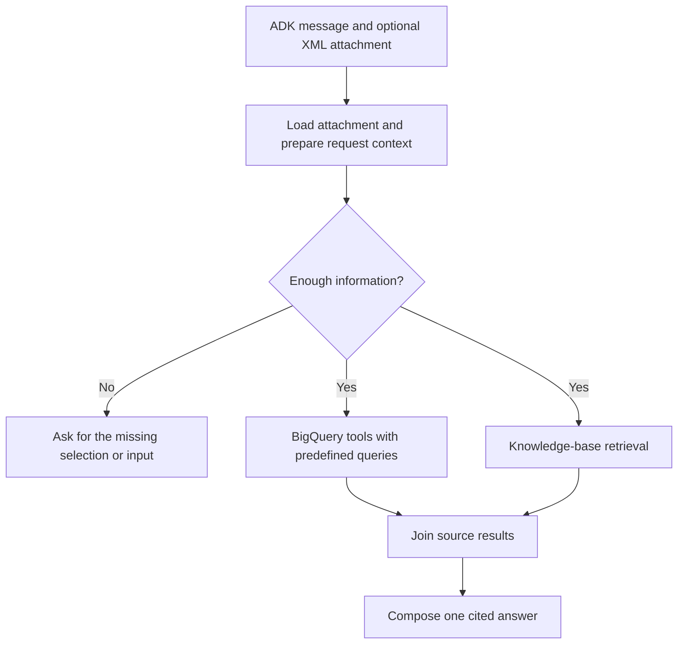

# ADK uploads, parallel evidence and predefined queries

Date: 2026-09-22. Follow-on to `BIGQUERY-AGENT-plan.md`.

For the merged/deployed baseline, code map, atomic next tasks and verification
commands, start with the [next-agent handover](next-agent-handover.md).

## Outcome

Use the existing ADK attachment button to analyse an XML work order in chat.
Resolve the request once, retrieve BigQuery history and knowledge-base evidence
concurrently, and return one answer with traceable sources. Common analytics
operations use checked-in parameterized SQL exposed as typed Python tools.

The first upload slice is implemented on `feat/adk-workorder-upload`: current
ADK XML attachments reach the shared parser and analysis service, with scoped
artifacts, version pinning, explicit selection and replay cutoffs. Ordinary chat
still routes to one specialist. Parallel evidence retrieval and predefined
query tools below remain planned. Attachment responses currently use uploaded
evidence only and explicitly report that BigQuery/IPC were not queried.

The actual ADK browser file input was exercised with the synthetic
`tests/fixtures/workorders/demo_nozzle_upload.xml`. The response retained its
unique WO, marker and serial pair without a database lookup. Deterministic ADK
integration tests cover all three configured target parts and session/version
boundaries; two CLI eval cases check the response and earlier replay exclusions.

Upload-slice validation on 2026-09-22: 130 unit/integration tests passed, including
22 ADK upload/ordinary-routing checks; Ruff passed. CLI response-contract scores
were 1.0/1.0 for uploaded facts and 1.0/1.0 for earlier replay exclusions.
This validates the upload slice, not the planned parallel evidence milestone.

Deployment on 2026-09-22: revision `853c947` updated the existing `pma-agent`
runtime (`9071133107117096960`, project `qwiklabs-asl-04-1726946cb8ab`,
`us-central1`). The full predeployment suite passed 136 tests, and the two
upload eval cases again scored 1.0/1.0. Live ADK requests verified the synthetic
uploaded facts, artifact version 0, and earlier replay from the saved artifact.
The runtime kept its existing app service account and 4 CPU / 8 GiB limits.

## Proposed flow

Both evidence branches run for work-order analysis and combined maintenance
questions. Pure greetings need no evidence calls. A question explicitly limited
to one source can use that source only. This replaces the current exclusive
IPC-versus-BigQuery decision for combined analysis.

The parsed attachment is the authoritative input work order. An existing
BigQuery row with the same WO number can be compared with it, but cannot silently
replace its contents. A demonstrator attachment absent from BigQuery must work.

## Request and result contracts

Prepare a typed per-turn request with question, source/artifact filename and
version, upload hash, selected WO, input mode, analysis timestamp, PN candidates,
aircraft/family/position, available symptoms, counters with provenance, and
exclusions. Reuse `amos_data.parser` and `WorkOrderAnalysisService`.

Detect the actual attachment representation used by the installed ADK UI
(inline data or session artifact); use the session-authorized loader rather than
user-supplied filesystem paths or arbitrary URLs. Preserve the existing XML byte
and safety limits. Keep metadata needed for follow-up questions scoped to the
session and selected artifact version.

For a closed XML, state explicitly that this is historical analysis. For a
current analysis, record the server analysis timestamp. Ask for a historical
cutoff when the user requests a replay at an earlier date, and require selection
when multiple WOs or unresolved target parts remain. Missing current TAC does
not block descriptive evidence retrieval; never substitute the closing TAC.

Each evidence branch returns its own structured result containing status,
records/excerpts, source IDs, citations, parameters, counts, truncation and error
details suitable for display. Branches do not overwrite shared result keys or
emit separate final answers. An error/timeout in one branch yields a partial
answer that identifies the missing source; it must not masquerade as no matches.

Use ADK graph fan-out and `JoinNode`, with normalization to JSON-serializable
results before joining. The final node emits content visible in the ADK UI.
Keep the current Gemini model configuration.

## Predefined BigQuery tools

| Tool | Validated inputs | Purpose |
|---|---|---|
| `get_workorder` | WO ID/number | Header and recorded descriptions, with source provenance |
| `get_workorder_actions` | WO ID/number | Recorded action text and times, separate from symptom features |
| `get_component_changes` | WO ID/number, optional PN | Exact on/off PN and serial pairs without invented position mappings |
| `get_part_history` | PN, optional aircraft/family/position, before timestamp, limit | Dated comparable history and own-aircraft history |
| `get_part_coverage` | PN, date range, optional family | WO/change/report counts with explicit counting units |
| `find_historical_symptoms` | Available symptoms, PN/context, as-of, corpus, exclusions, method, limit | Reuse existing keyword/vector/hybrid provider |
| `find_faa_reports` | PN/context, as-of, limit | Separate public report evidence with supported availability |

Store SQL in package resources, with a shared Python query runner and typed
wrappers. CLI scripts may call the same wrappers for testing; the runtime need
not launch subprocesses. The agent selects an allowed tool and arguments. It
does not generate SQL for these operations.

Use real BigQuery parameters such as `@part_number`, `@workorder_number`,
`@as_of` and `@limit`. Project/table identifiers come from code-owned allowlists.
Preserve byte/time/result limits, cancellation, stable ordering, case-level
deduplication and explicit errors. Count work orders separately from component
changes. FAA reports remain separate from AMOS installation timelines.

Remove generic `execute_sql` and forecasting tools from the normal evidence
workflow. Add aggregate templates for supported common chat questions; report
unsupported query intents explicitly rather than silently generating SQL.

Canonical views already have Terraform definitions but are not deployed. First
verify deterministic lookup templates against the existing tables using the
same reviewed parent-child projections. Switch to the canonical views when
they are deployed, with parity checks. Semantic history remains unavailable
until its declared corpus and embeddings are loaded; do not hide this by
silently changing retrieval method.

## Knowledge-base branch and final answer

Query the existing IPC datastore using resolved PN/component context. Return
retrieved excerpts and real document/page/revision metadata when available.
Do not reconstruct unsupported citation details from model memory. Distinguish
family-level catalogue presence from applicability to a specific aircraft.

The final answer distinguishes:

1. What the uploaded work order records.
2. What earlier BigQuery cases establish, with scope and dates.
3. What the retrieved manual pages establish.
4. Missing/conflicting evidence and unavailable predictions.

IPC references to AMM/CMM documents are not the full procedures. Catalogue
quantities are not cycle limits. Model/policy availability remains controlled
by the analysis service; the synthesis model cannot turn retrieval scores,
closing counters or case intervals into failure probabilities or deadlines.

## Atomic implementation tasks

| ID | Deliverable | Dependency | Acceptance |
|---|---|---|---|
| P1 | Typed request and source-result contracts | None | Explicit new/replay context, missing-input handling, per-source status |
| P2 | Fixed lookup/history/count SQL and Python tools | P1 | Parameterized values, nested-row counts/serials correct, budgets and errors tested |
| P3 | ADK attachment-to-context node | P1 | Actual UI XML upload absent from BigQuery reaches the shared parser; session/version boundaries retained |
| P4 | IPC evidence adapter | P1 | Retrieved citations and applicability limits retained; empty/error cases explicit |
| P5 | Parallel graph, join and final answer | P2/P3/P4 | Both branches overlap in execution; one answer; one-source failures handled |
| P6 | Live UI demonstration and regression evaluation | P5 | All three PNs, synthetic unknown WO, replay/self exclusion, source citations, timing abstention |

P2, P3 and P4 can be assigned to independent lower-cost implementation agents
after P1 stabilizes. The orchestrator owns graph integration and acceptance.

The first end-to-end milestone is a synthetic XML uploaded through the actual
ADK UI, a trace proving that its bytes were parsed, concurrent BQ/IPC evidence
calls, and one cited response with honest source availability. Then repeat the
real WO 105177647 example and test the boiler and oven.

Separately prepare and validate the deployment/loading changes needed for full
historical retrieval. This work does not authorize an infrastructure apply or
claim completion of the data-blocked predictive objective.
