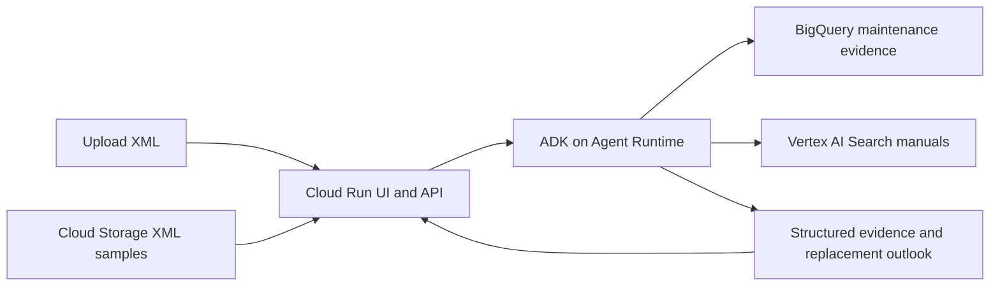

# Ryanair maintenance UI — working plan

Status: discussion draft. The Google ASL capstone context, Ryanair branding and
work-order analysis journey are confirmed. Technology, access, demo samples and
detailed screen designs remain proposals.

Frontend progress: an independent React/TypeScript prototype now lives in
`frontend/`. It implements both input tabs, review, simulated analysis, result
states and How it works. Cloud samples are local synthetic scenarios; services
are not connected. See `frontend/README.md` for running and integration notes.

## Confirmed direction

- Use Ryanair branding. The requester is a Ryanair employee.
- Internal brand guidelines are unavailable. Use the official public Ryanair
  website as the visual reference.
- This is a Google ASL capstone about Google Cloud and its solutions, to be
  presented to a broad audience. Design for a presenter-led demonstration and
  explain the maintenance context in plain language.
- Make the primary journey: select one XML work order, review its components,
  select the component to analyse, and see its replacement outlook.
- Manual XML upload and/or selection directly from storage are suitable inputs.
  Recommend supporting both in the first version, using Google Cloud Storage.
- A future operational version would react to a work order arriving in AMOS.
  The capstone does not require a live AMOS integration.
- Focus this work on the user interface and its integration with the ADK backend.
- Develop the frontend independently while the backend and its contracts evolve.
  Use mock data behind a typed adapter; backend changes should be translated at
  that boundary instead of spreading throughout the screens.
- Prefer hosting in the existing Google project.

## Capstone presentation experience

Tell a short, repeatable story: a work order describes a component problem; the
system identifies the component, gathers relevant evidence, and presents a
replacement outlook or explains why it cannot estimate one yet.

The main **Analyse work order** view should be easy to follow on a projected
screen: large labels, a visible selected component, few primary actions and
plain-language results. Explain "flight cycles" once as take-off/landing cycles.
Use component descriptions alongside part numbers; introduce AMOS as the source
maintenance system. Put detailed counters, timestamps and source records behind
expandable sections while keeping missing required inputs visible.

Add a separate **How it works** view for the educational part of the presentation.
Show the proposed Google Cloud architecture, what each service does, and which
capabilities are implemented versus planned. The main workflow can say "Checking
maintenance history"; this view can explain the corresponding BigQuery/ADK step.
Only mark services as active when an actual request/event supports that status.

Provide "Start another analysis" to reset the working flow. A curated cloud sample
library makes the demonstration repeatable; a clear live-service error lets the
presenter retry or choose another sample. Optional saved demonstration results
must be explicitly opened and labelled as recorded/illustrative, never silently
substituted when live analysis fails.

## Visual direction

- Use the official Ryanair logo, typography and colour specifications from the
  agreed brand source. No brand asset bundle was found in this repository.
- Build around Ryanair blue and yellow: blue navigation and headings, yellow
  primary actions with dark text, white content cards and a light page background.
- Use a clear numbered journey, prominent actions, compact navigation and generous
  spacing, drawing on the booking flow's familiar interaction patterns.
- Keep work-order and component identity visible throughout analysis and results.
- Use readable tables, aligned numerical values and explicit cycle/date units.
- Convey status through text and icons as well as colour. Check keyboard operation,
  focus visibility and contrast when choosing the final colour tokens.
- Prioritise desktop use, with layouts that remain usable on tablets and phones.

Brand reference: [Ryanair's official website](https://www.ryanair.com/gb/en).
This replaces the request for internal guidelines; obtaining those guidelines is
not a prerequisite for the UI design.

Reference check on 2026-09-23: the public homepage HTML was accessible and declares
browser theme colour `#0d49c0`. This is a browser theme value, not a verified full
brand palette. The rendered page, stylesheet values, font files and logo variants
have not yet been inspected. Asset verification remains an implementation follow-up.
Do not describe guessed colour/font values as official specifications.

## Proposed screens

| Step | Main content | Primary action |
| --- | --- | --- |
| Select work order | Two tabs: Upload XML and Choose from Cloud Storage; filename/sample summary; selection and validation feedback | Review work order |
| Review | Work-order and aircraft identity; symptoms; candidate parts, serials and positions; work-order/component selection where needed; missing inputs | Analyse component |
| Analysis | Actual backend progress; maintenance-history and manual retrieval status; recoverable errors and partial results | View result when ready |
| Replacement outlook | Remaining-cycle estimate, estimated calendar window, uncertainty and assumptions; evidence and source details; data availability | Review evidence / analyse another work order |

### Layout proposal

Use one consistent application shell: a blue brand header, the working product
title **Maintenance Intelligence**, a discreet **Google ASL capstone** label, and
the four-step journey immediately below it. The product title is a proposal.
Keep the main page width constrained for readable forms and evidence, with the
current step visually prominent. Navigation offers Analyse work order and How it
works.

- **Select work order:** heading "Analyse a work order". The Upload XML tab has
  a large drop zone and file-picker button, followed by filename and validation
  feedback. The Choose from Cloud Storage tab has a short list of curated sample
  cards with component description, work-order identifier, status and a plain
  explanation of the scenario. Show only verified sample metadata. Once a file
  is selected, show the yellow "Review work order" action. Keep the source label
  (Uploaded XML / Cloud Storage sample) visible through subsequent steps.
- **Review:** use the main column for extracted work-order details and selectable
  component rows. Each row shows part number, description, serial, position and
  recorded role (installed/removed/other/unknown). A summary panel holds aircraft,
  selected work order, analysis date and any required input corrections. Keep
  source-extracted facts visually distinct from user-supplied values.
- **Analysis:** retain the selected component summary. Show a compact vertical
  checklist with pending, running, complete or unavailable states reported by the
  backend. Do not use a fabricated percentage or expose internal agent identifiers.
- **Results:** put the selected part and serial above two prominent cards for
  remaining cycles and estimated calendar window. Follow with a cycle timeline
  when supported, utilisation assumptions and the separately sourced replacement
  recommendation. Expandable sections hold maintenance history, manual references
  and missing data. Unavailable predictions use the same layout with reasons and
  next steps in place of numbers; do not display zero as a missing value.

On narrow screens, move the summary panel above the main content and stack result
cards. Evidence tables may scroll independently with their column labels retained.

The review screen must distinguish the removed component from the installed
component. It must also distinguish current aircraft total cycles from historical
counters and component service age. Missing or stale inputs must remain visible.
Closed work orders require a clearly labelled historical review mode and analysis
cutoff; they must not silently become a forecast for a currently installed part.

The results screen should lead with cycles and timing when supported. A calendar
window needs an explicit utilisation assumption or observed operating schedule.
A model estimate and a documented replacement limit/recommendation require
separate labels and sources. Show uncertainty only when provided by the backend.

Required states include invalid/oversized XML, multiple work orders, ambiguous or
unsupported components, missing counters, no matching history, source unavailable,
analysis failure, partial evidence, and estimate unavailable. No matching records
and a failed retrieval are distinct outcomes. The storage tab also needs loading,
empty library, unavailable source and selected object no longer available states.

## Cloud Storage selection

This is a new frontend/backend feature, not an existing storage browser. The
repository configures an analytics data bucket named
`qwiklabs-asl-04-1726946cb8ab-pma-agent-data`. Its Terraform work-order object is
`workorders/wo_workorders.ndjson.gz`, not a selectable collection of XML uploads.
The current bucket contents have not been checked remotely.

Propose a curated `demo/workorders/` XML prefix and a small sample manifest in the
configured data bucket. Populate it during implementation with selected capstone
fixtures; use visibly synthetic samples for the default broad-audience demo.
Existing local fixtures can seed the library, but the chosen samples and their
metadata need review. Storage samples should contain actual XML inputs; they do
not imply that a validated forecast exists.

The server lists the configured sample library and loads the selected object,
pinned to its object generation. Record bucket, object, generation and content
hash as provenance. Validate the XML using the same limits and parser as manual
uploads, then pass either input source into the same work-order analysis workflow.
Changing an object between listing and selection should trigger a refresh/reselect
message, not silently analyse different bytes.

Keep bucket configuration and Google credentials on the server. Read access is
limited to the configured sample library; the browser selects a returned sample
identifier rather than supplying arbitrary bucket paths. Selecting a sample must
not modify the source file or insert it into the historical evidence corpus.

## Existing backend and integration boundary

The backend is actively being developed in parallel. The observations below are
a planning snapshot, not a frozen contract or a request to change its current code.
The prototype owns its presentation types in `frontend/src/domain.ts` and isolates
data access in `frontend/src/data/client.ts`. No HTTP endpoints are hardcoded in
the prototype. Both UI and backend teams can revise their internal structures;
the live adapter will map between them when the integration is ready.

- `pm_agent/fast_api_app.py` exposes `POST /workorders/analyze` for one XML upload.
  It returns structured analysis without invoking the chat model.
- `pm_agent/agent.py` handles XML attachments through the deterministic work-order
  path; ordinary chat routes to the IPC or BigQuery specialist.
- Session-scoped ADK artifacts can already use GCS, but this is distinct from the
  proposed curated Cloud Storage input library. Add a server-side adapter so both
  upload and storage selection supply XML to the same analysis/session flow.
- The complete agent workflow for gathering evidence and producing a forecast
  remains a backend dependency. UI activity indicators must reflect real events.
- Current prediction, timing and replacement recommendation fields are unavailable.
  The fixed-corpus readiness audit does not establish a validated prediction model.
- The UI can be prototyped with clearly labelled demonstration forecasts, and
  integrated with real XML/evidence responses before predictions are available.
  Live responses must preserve unavailable states and their reasons.

Agree a structured response contract for component identity, analysis cutoff,
progress, per-source status, forecast units/ranges, utilisation assumptions,
recommendation source and missing-data reasons. Avoid extracting these fields
from free-form chat text in the browser.

## Proposed hosting

The repository configures Google Cloud project `qwiklabs-asl-04-1726946cb8ab` in
`us-central1`, and records an existing Agent Runtime deployment. This is local
configuration evidence; current project access and service health were not checked.

Proposed architecture: React + TypeScript UI and a small server-side API layer on
Cloud Run, connected to Cloud Storage inputs and the existing ADK Agent Runtime.
The server handles Google Cloud credentials and translates runtime responses for
the browser. ADK evidence retrieval uses the existing BigQuery and manual-search
services as their integration becomes available.

This diagram is the proposed target, not a claim that every connection is live.
The data/model dependency still governs whether an outlook can contain a forecast.

Access should suit a capstone presentation; Ryanair employee SSO is not a presumed
requirement. Decide presenter-only access versus access for audience members when
preparing the hosted demo. Google Cloud hosts the app.

## Future AMOS ingestion

Show this as a future path in How it works: AMOS export/integration produces an XML
object in a landing bucket; an object-created event starts the same analysis;
stored results appear in a work-order inbox. AMOS-to-storage connectivity requires
a real export/integration and is not assumed to exist.

Cloud Storage events and Eventarc/Pub/Sub are potential trigger infrastructure.
Select the exact delivery mechanism during implementation of this future phase.
The event consumer needs durable job state and deduplication by source object
generation so retries do not create duplicate analyses. Before implementing that
phase, study the `ambient-expense-agent` event-driven ADK recipe referenced by the
agent workflow skill.

For the capstone, manually choosing a stored XML demonstrates the shared input
boundary. It must not be presented as a live AMOS subscription or an automatic
storage trigger.

## Delivery sequence

1. Produce the four screen designs using the public Ryanair brand reference and
   real XML fields; verify exact assets when the public bundles are accessible.
2. Build a clickable prototype with both input tabs, the four steps, result states
   and How it works. Agree a short presentation walkthrough.
3. Add the curated GCS XML library and server adapter; integrate both input paths
   with real XML analysis, then ADK progress and structured evidence/results.
4. Verify that the same XML from either source produces equivalent analysis;
   check upload/storage errors, selection, counter/date semantics, accessibility
   and demo access. Prepare the deployable frontend and infrastructure plan.
5. Deploy after deployment approval and rehearse the hosted walkthrough, including
   a clear explanation of current evidence support and future prediction/AMOS work.

Initial acceptance: a presenter can upload XML or select a cloud sample, verify the
component being analysed, and explain the supported result or why an estimate is
unavailable. An audience member can follow which Google Cloud services contribute.
Demonstration values never appear as live predictions. Fleet dashboards, bulk
upload and live AMOS ingestion are outside the proposed first version.

## Next design decision

Review the first prototype (`frontend/dist/preview.html`, generated by
`npm run build:preview` from `frontend/`) and the presentation walkthrough.
It includes two illustrative forecast scenarios and one missing-data scenario,
with persistent preview/source labels. These are editable demo choices, not
backend or prediction requirements. The next integration step is to agree the
live adapter contract once the backend response and progress events settle.

Verification (2026-09-23, real Chrome): the first browser run passed the original
seven Playwright tests. A multi-lens audit at widths 320–1920 then confirmed 55
defects, and those were fixed. The main ones were:

- A white-screen crash from tiny utilisation values.
- Disclaimer text at 8–10px and below WCAG AA beside 43px fictional numbers.
- A replacement-window bar that looked like a scale but was hard-coded identically
  for every scenario.
- Focus lost to `<body>` on every backward move.
- An invisible focus ring on the header.
- A stale sample selection that survived switching to the upload tab.
- No button visible above the fold at 1280×800.

The suites now stand at 20 Playwright and 16 JSDOM tests, all passing. Fourteen
deliberate regressions, one per product rule, each turn a suite red. The
standalone `preview.html` runs over `file://` with no network requests and no
console errors.

Still open: the wordmark and fonts remain provisional (system fonts, not verified
brand assets). At 1280×800 "Choose XML file" is on screen, but "Review work order"
still needs a short scroll. Screen-reader announcements are implemented but were
not tested with a real screen reader. No deployment or live cloud integration has
been performed.
